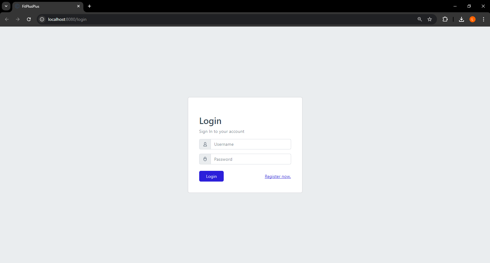
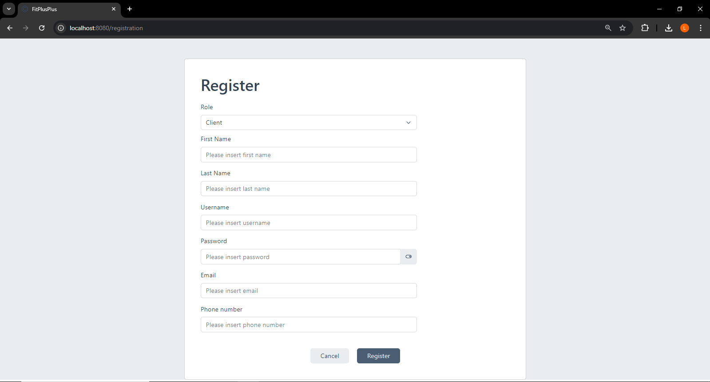
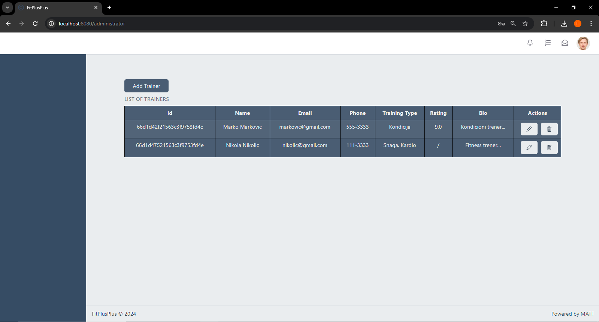
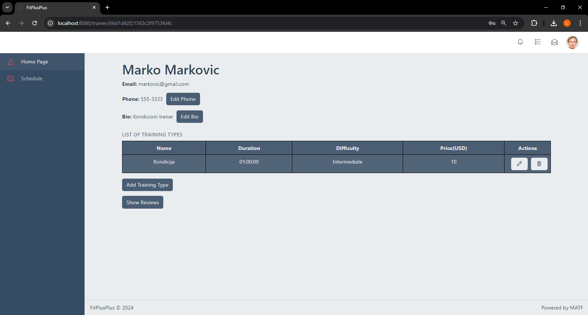
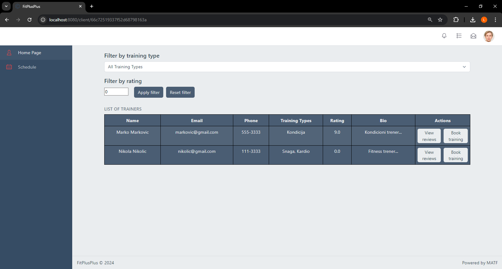

# FitPlusPlus
Studentski projekat iz predmeta Razvoj softvera 2. Mikroservisna fitness aplikacija koja olakšava zakazivanje i otkazivanje treninga trenerima i korisnicima. 
## Učesnici
 - Lazar Stanojević (1013/2023)
 - Vasilije Todorović (1015/2023)
 - Nikola Belaković (1023/2023)
## Tehnologije
Frontend aplikacije je implementiran korišćenjem radnog okvira **Vue**, dok je backend aplikacije rađen u programskom jeziku **C#** korišćenje radnog okvira **.NET**.

Takođe je projekat kontejnerizovan korišćenjem **Docker** alata.
## Mikroservisi
Mikroservisi od kojih se sastoji ova aplikacija su:
  - **IdentityServer** (servis za logovanje)
  - **ClientService** (servis za klijenta aplikacije)
  - **TrainerService** (servis za trenere)
  - **ReviewService** (servis za ocenjivanje trenera)
  - **PaymentService** (servis za plaćanje zakazanog treninga)
  - **Frontend** (*single-page* aplikacija napravljena u Vue-u)

## Uputstvo za korišćenje aplikacije

Da biste pokrenuli *backend* aplikacije pozicionirajte se u terminal u folder ``Fitness/Backend`` unutar projekta. Zatim pokrenite sledeću komandu:

```
docker-compose -f docker-compose.yml -f docker-compose.override.yml up -d --build
```

Zatim kada je *backend* pokrenut premestite se u folder ``Fitness/Frontend`` u projektu, i pokrenite sledeće komande:
```
npm install
npm run serve
```

Zatim otvorite svoj veb pregledač i pristupite adresi ``http://localhost:8080``

Treblao bi da se pojavi sledeća slika:



Sledeće što treba uraditi je da se otvori nalog klikom na dugme **Register now**, popunite podatke i nakon uspešne registracije, ulogujte se popunjavanjem korisničkog imena i šifre, i potom pritiskom na dugme **Login**.



Nakon logovanja, u zavisnosti od role u sistemu, pokazaće se jedna od tri moguće stranice.







Administrator vidi listu trenera, koju može da ažurira dodavanjem novih, brisanjem ili izmenom postojećih trenera.

Trener može da menja svoje podatke, kao i da dodaje tipove treninga koje drži. Pored toga, može da vidi i svoj raspored treninga za tekuću, i 2 naredne nedelje. Između ostalog, može i da otkaže trening.

Klijent vidi spisak trenera, gde može da ostavi recenziju za trenere kod kojih je imao trening, kao i da izabere trenera kod koga želi da zakaže trening. Zakazivanje se vrši klikom na dostupno polje u rasporedu, nakon čega ga to vodi na PayPal stranicu, gde vrši plaćanje treninga. Takođe, može i da vidi svoj raspored, gde po sličnom principu može da otkazuje treninge.
